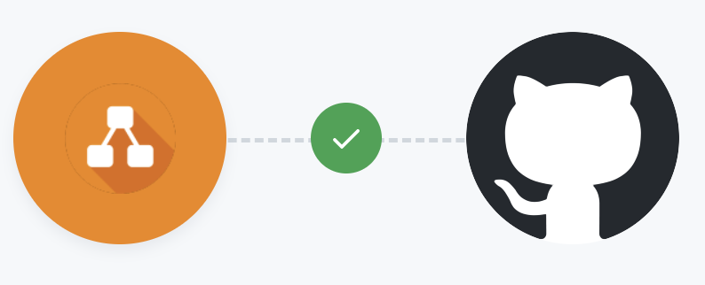
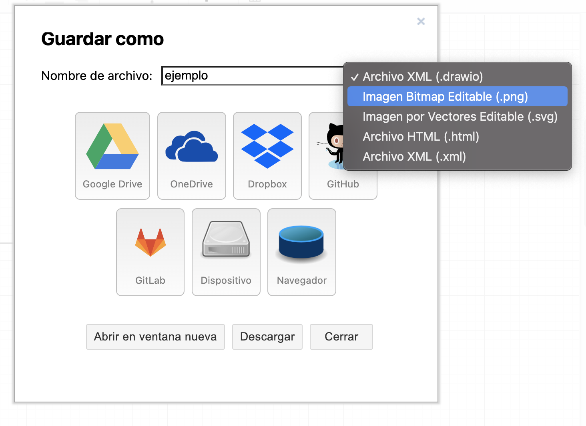
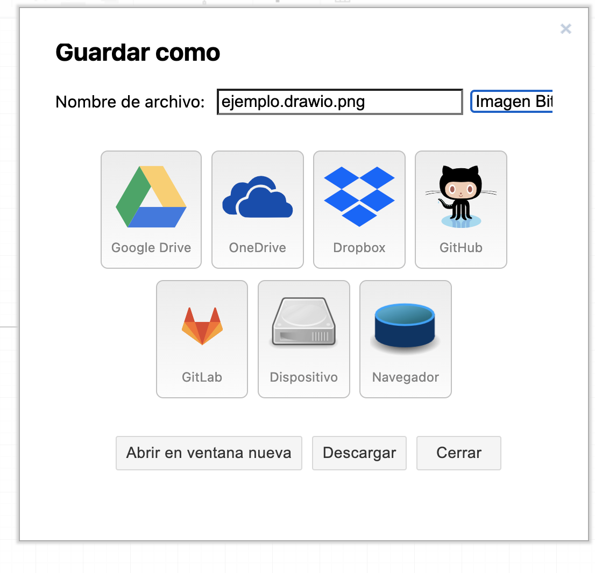
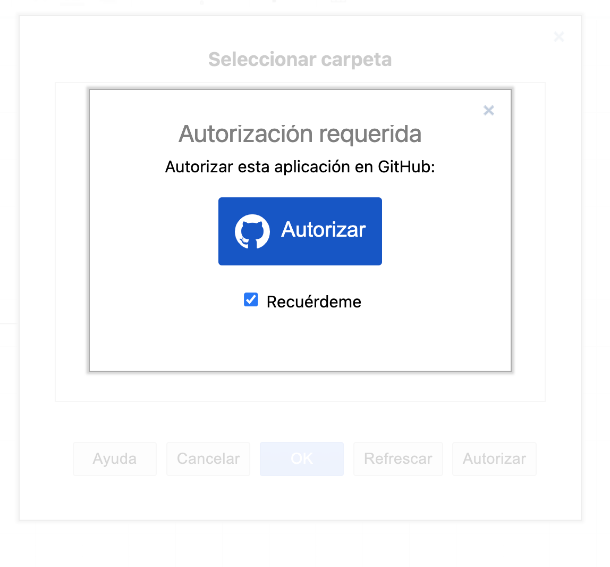
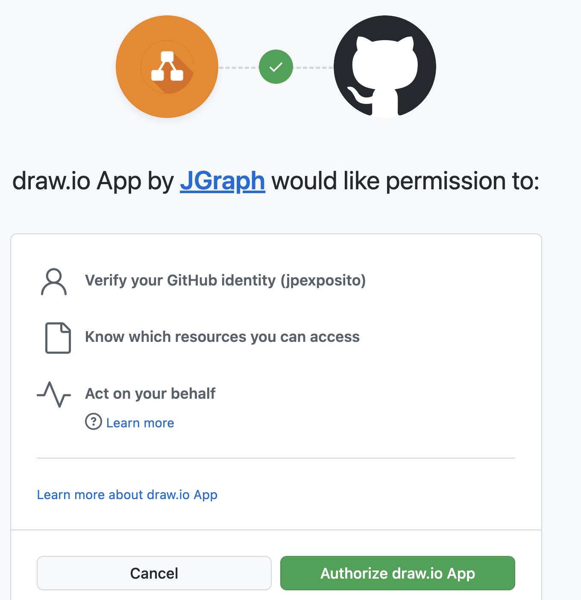
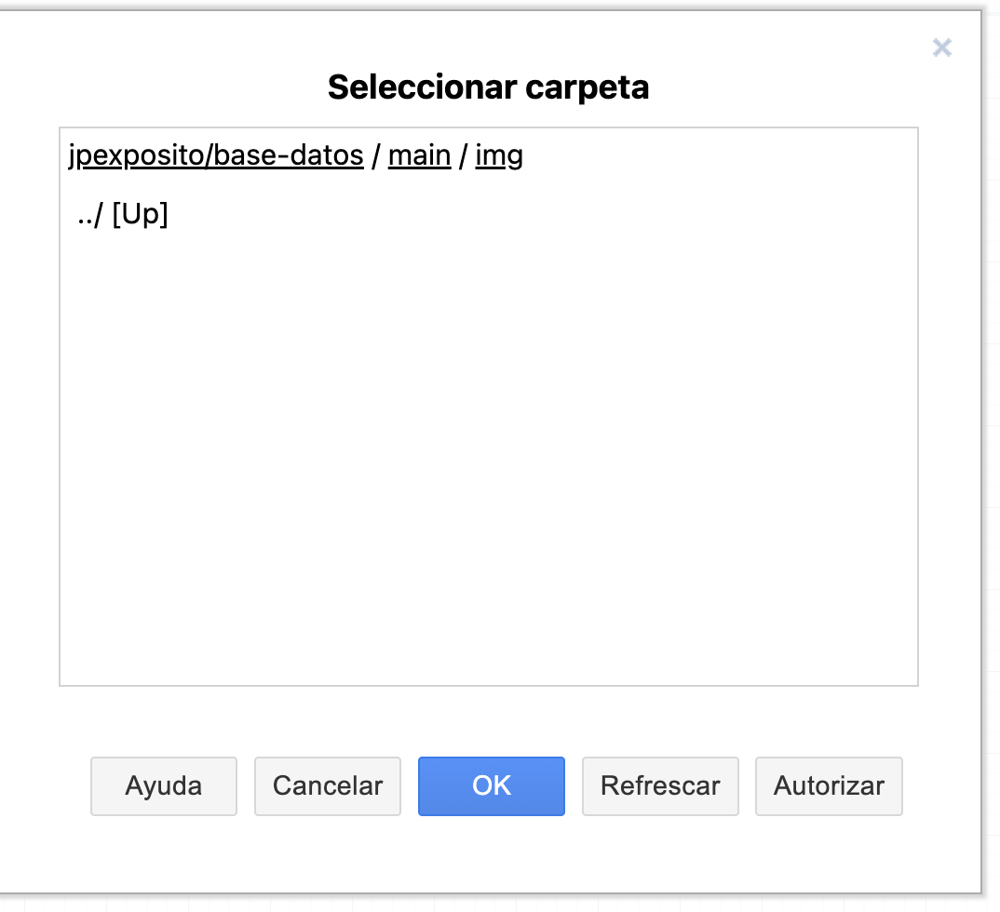
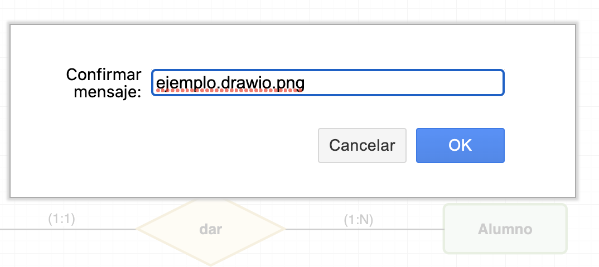
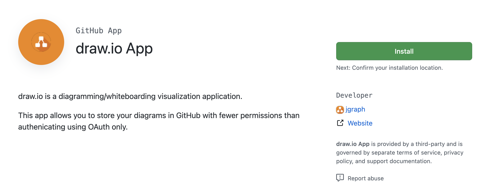
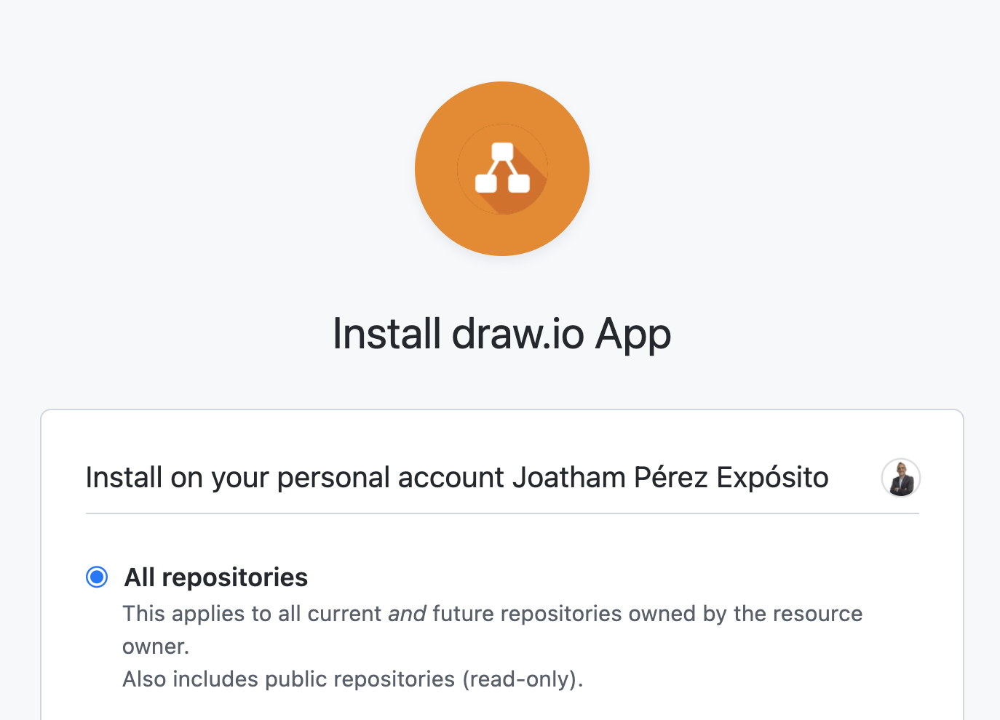
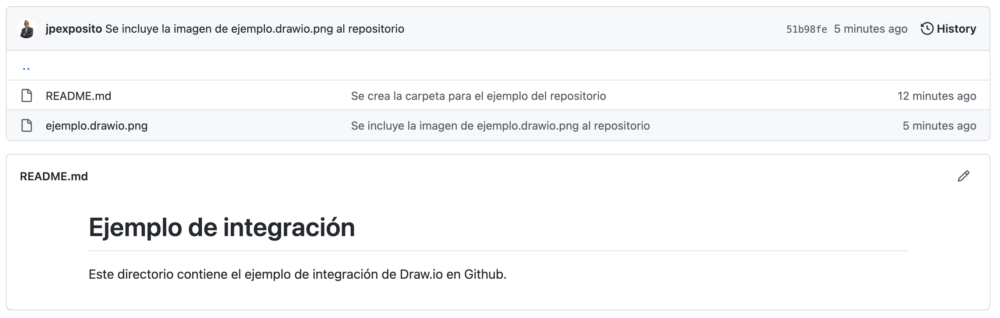

# Trabajando en la nube con diagramas

## ¿Qué necesitamos?
Existen numerosas herramientas para realizar diagramas. No vamos a detallar cada, ni los mejores, ni los peores, sólo alguno de ellos, en función de una característica, que es su precio.
- App.diagrams.
- GitMind.
- LucidChart.
- Coggle.
- SketchBoard.
- Creately.
- Canva.
### Necesitamos
Necesitammos una herramienta que sea gratuita, que se integre con otras herramientas y nos permita automatizar las actualizaciones, evitando tener que __exportar imágenes, modificar documentos (odt) y generar pdf´s__.
## ¿Cómo lo resolvemos?

La elección para salvar estos problemas será: __Github + App.diagrams.__

#### App.diagrams

App.diagrams es una aplicación web gratuita y de código abierto que te permite crear una gran variedad de diagramas desde cualquier navegador web. La herramienta también posee una versión de escritorio disponible para _Windows, Linux y macOS_.

Con esta herramienta puedes crear y editar una gran variedad de diagramas como: _diagramas de flujo, diagramas entidad-relación, diagramas UML, organigramas, diagramas de procesos, mapas mentales, modelos de procesos de negocios, entre otros_. Permite agregar imágenes, configurar los textos, elegir el tipo de fuente, cambiar el idioma y además puedes guardar tu archivo para configurarlo después. Asimismo incorpora notaciones matemáticas y capas que facilitan la edición. Básicamente es un __editor online y gratuito__.

##### ¿Cómo funciona App.diagrams?

Para comenzar a realizar tus diagramas solo debes ingresar a https://app.diagrams.net/, te pedirá que elijas donde deseas guardar tus diagramas si en __Google Drive, One Drive o localmente__, entre otros. Puedes elegir uno de estos o le puedes dar Click en decidir más tarde.

A continuación te aparecerá la interfaz donde dispondrás de distintas formas y diseños personalizados para empezar a realizar tu diagrama. Esta herramienta es bastante intuitiva y tiene la funcionalidad de arrastrar y soltar.

Luego de que tengas listo tu diagrama tienes varias opciones para guardarlo:

- Exportar tu diagrama como __.xml__ y modificarlo después.
- Exportar en formatos como __PNG, JPG, GIF o PDF__.
- Guardar tu diagrama en __Google Drive, One Drive, Dropbox, GitHub, GitLab, Trello o en el navegador__.
- Exportar el diagrama como __URL__ e __insertarlo en tu sitio web__.

#### Github
GitHub es una __plataforma de desarrollo colaborativo__ para alojar proyectos utilizando el sistema de control de versiones Git.
___El 4 de junio de 2018, Microsoft compró GitHub. GitHub continúa siendo la plataforma más importante de colaboración para proyectos de código abierto___. 

## Integrando todo

Vamos a realizar la integración de app.diagrams dentro de nuestro repositorio Github, de modo que podamos integrar una imagen dentro de un repositorio y editarlo de forma online, sin tener que exportar y modificar la imagen.
##### Requisitos:
- Repositorio público.
- Almacenar en Github, y seguir los pasos de integración.
  - __Paso 1:__ 

  
  - __Paso 2:__ 

  - __Paso 3:__

  - __Paso 4:__

  - __Paso 5:__

  - __Paso 6:__

  - __Paso 7:__

  - __Paso 8:__

  - __Paso 9:__

  Autorización en el/los repositorio/os que deseas que este activo, y guardar la imagen para poder editar en el futuro, y poder integrar de forma eficiente.

  - __Paso 10: Resultado final__

__Pd__: Aquello que hagas, intenta hacerlo lo mejor posible y siempre con una &#128513;. Siempre con mucho cariño &#x2764;.
## Referencias
- [Conocimiento libre.](https://conocimientolibre.mx/que-es-diagrams-net/#:~:text=Diagrams.net%20es%20una%20aplicaci%C3%B3n,para%20Windows%2C%20Linux%20y%20macOS.)
- [Almacenamiento de diagramas.](https://www.diagrams.net/blog/cloud-storage-diagrams)
- [Wikipedia -GitHub.](https://es.wikipedia.org/wiki/GitHub)

## Conecta conmigo

  
  

 

